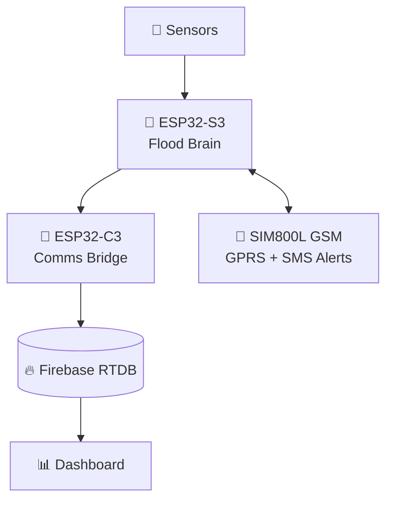
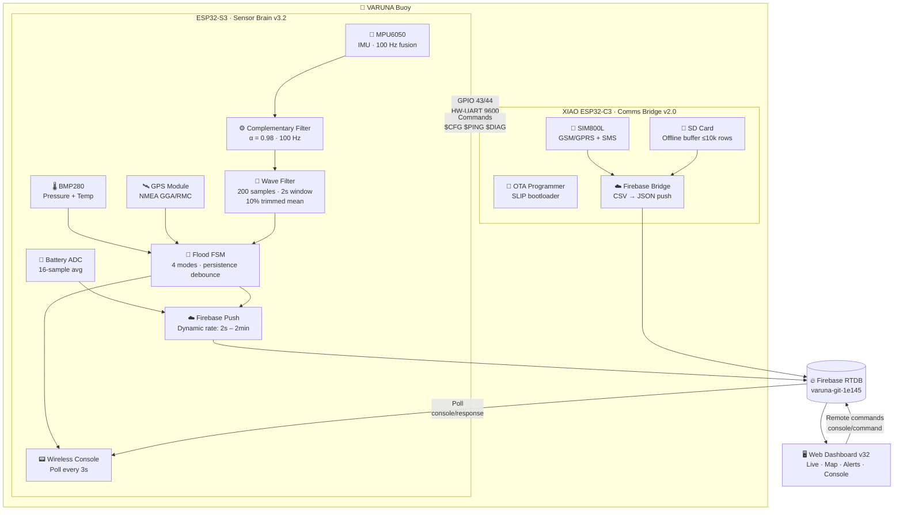
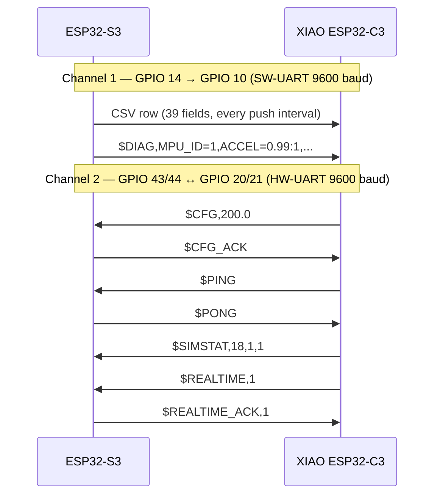
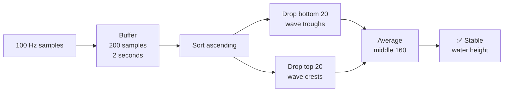
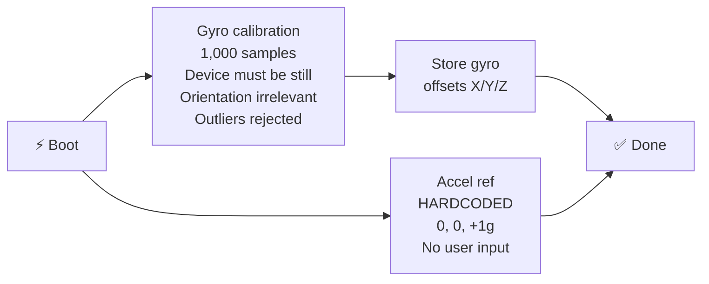
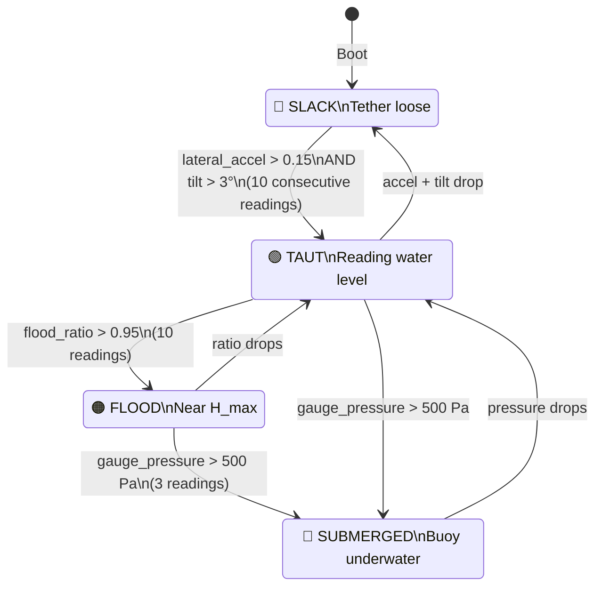
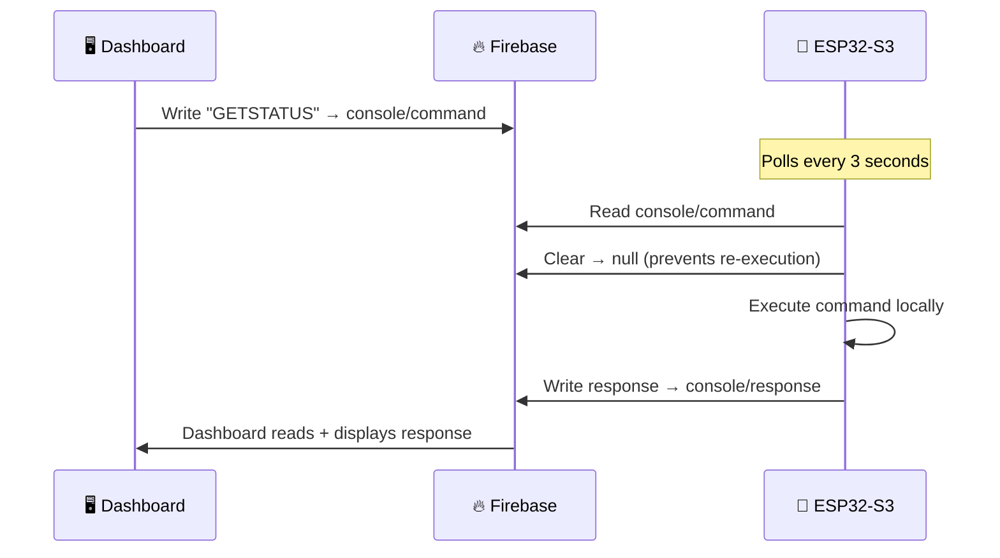
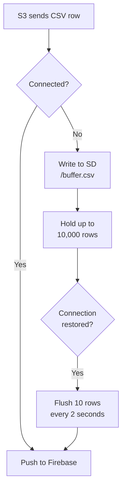
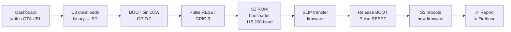
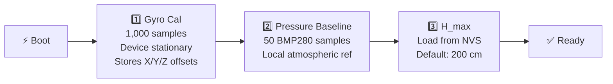

<div align="center">

# 🌊 VARUNA
### Tethered Autonomous Flood-Monitoring Buoy


<br/>

**VARUNA** is a **tethered, autonomous flood-monitoring buoy** for real-world deployment in rivers, canals, and urban drainage systems. It senses, classifies, and reports water levels continuously — pushing live telemetry to Firebase and triggering email alerts when flood thresholds are crossed.

---

## ▶️ PROJECT OPERATIONAL VIDEO — Click on image to Watch

[](https://youtu.be/_P6k8nGx6x4)

</div>
---

## 📑 Table of Contents

- [System Overview](#-system-overview)
- [Architecture Diagram](#-architecture-diagram)
- [Hardware](#-hardware)
- [Two-MCU Design](#-two-mcu-design)
- [Inter-MCU Communication](#-inter-mcu-communication)
- [Sensing & Signal Processing](#-sensing--signal-processing)
- [Flood Detection Engine](#-flood-detection-engine)
- [Firebase Cloud Integration](#-firebase-cloud-integration)
- [Web Dashboard](#-web-dashboard)
- [SD Buffering & OTA](#-sd-buffering--ota)
- [Calibration](#-calibration)
- [Serial Commands](#-serial-commands)
- [Diagnostics](#-diagnostics)
- [Pin Reference](#-pin-reference)

---

## 🗺 System Overview


Sensors → ESP32-S3 (Flood Brain) → ESP32-C3 (Comms Bridge) → Firebase RTDB → Dashboard
                                         ↕
                                     SIM800L GSM
                                   (GPRS + SMS alerts)

Three layers, one purpose: **detect flooding early and report it reliably.**

| Layer | Component | Role |
|---|---|---|
| 🧠 Sensing | ESP32-S3 | All sensor fusion, flood classification, Firebase push |
| 📡 Comms | XIAO ESP32-C3 + SIM800L | Data relay, SD buffering, OTA, cellular uplink |
| ☁️ Cloud | Firebase RTDB | Telemetry store, command channel |
| 🖥️ Dashboard | `varuna_dashboard_v32.html` | Live monitoring, alerts, analytics, remote console |

---

## 🔷 Architecture Diagram



---

## 🔩 Hardware

| # | Component | Interface | Notes |
|---|---|---|---|
| 1 | **ESP32-S3** | — | Sensor brain, WiFi to Firebase |
| 2 | **XIAO ESP32-C3** | — | Comms bridge, OTA programmer |
| 3 | **MPU6050** | I²C Bus 0 · GPIO 8/9 | ±2g accel, ±250°/s gyro, 200 Hz, DLPF 44 Hz |
| 4 | **BMP280** | I²C Bus 1 · GPIO 4/5 | Pressure ×16 oversample, filter ×16 |
| 5 | **GPS Module** | UART1 · GPIO 6/7 | GGA + RMC, checksum verified |
| 6 | **SIM800L** | Via C3 | GSM/GPRS uplink + SMS alerts |
| 7 | **SD Card** | SPI · C3 GPIO 4–7 | Offline CSV buffer |
| 8 | **Li-Ion Battery** | ADC · S3 GPIO 2 | ×2 voltage divider, 16-sample avg |

---

## 🧠 Two-MCU Design

### ESP32-S3 — The Brain

Runs all sensing and intelligence. The C3 **never** sees or interprets sensor data.

- ✅ MPU6050 + BMP280 + GPS + Battery sensing
- ✅ 100 Hz complementary filter sensor fusion
- ✅ 2-second wave-filtered water height (trimmed mean)
- ✅ 4-mode flood state machine with persistence debounce
- ✅ Dynamic Firebase push rate (2 s → 2 min)
- ✅ NTP-synced software RTC (IST, UTC+5:30)
- ✅ H_max persisted in NVS (survives reboots)
- ✅ Direct Firebase REST `PUT` / `GET` over TLS
- ✅ Wireless console via Firebase polling (every 3 s)

### XIAO ESP32-C3 — The Pipe

A dumb relay. Moves data, doesn't think about it.

- ✅ Bit-bang SW-UART RX from S3 GPIO 14 (interrupt-driven)
- ✅ CSV → JSON conversion and Firebase push
- ✅ SD card offline buffer (≤ 10,000 rows)
- ✅ Batch flush when connectivity restores (10 rows / 2 s)
- ✅ SIM800L GSM/GPRS management + SMS
- ✅ Firebase command polling → forward to S3
- ✅ OTA firmware programming of S3 via SLIP bootloader
- ✅ `$PING` ↔ `$PONG` health check with S3

---

## 📡 Inter-MCU Communication

Two physical wires between S3 and C3:



### Command Protocol

| Message | Direction | Purpose |
|---|---|---|
| `$CFG,<hMax>` | C3 → S3 | Set tether length / H_max |
| `$SETHMAX,<cm>` | C3 → S3 | Set H_max from dashboard |
| `$REALTIME,<0\|1>` | C3 → S3 | Toggle real-time push mode |
| `$DIAGRUN` | C3 → S3 | Request hardware diagnostic |
| `$PING` / `$PONG` | Both | Health check |
| `$SIMSTAT,<rssi>,<reg>,<avail>` | C3 → S3 | SIM800L status update |
| `$CFG_ACK` / `$HMAX_ACK` | S3 → C3 | Config acknowledged |
| `$DIAG,...` | S3 → C3 | Full diagnostic result frame |

---

## ⚙️ Sensing & Signal Processing

### 📐 Tether-Angle Water Height Model

VARUNA is anchored at a known tether length `L`. As water rises, the buoy floats and the tether angle `θ` increases:

```
H = L × cos(θ)
```

| Symbol | Meaning |
|---|---|
| `H` | Water height (cm) |
| `L` | Tether length = H_max (cm), stored in NVS |
| `θ` | Combined tilt angle from vertical (degrees) |

When **submerged**, BMP280 gauge pressure is used instead:

```
depth_cm = (gauge_pressure_Pa / (ρ × g)) × 100
H        = L + depth_cm
```

---

### 🌊 Wave Filter — 2-Second Trimmed Mean



> Every flood decision is made on this filtered value — never a raw reading.

---

### 🔄 Complementary Filter — 100 Hz Sensor Fusion

```
filtTiltX = 0.98 × (filtTiltX + gyroX × dt) + 0.02 × accelTiltX
filtTiltY = 0.98 × (filtTiltY + gyroY × dt) + 0.02 × accelTiltY
θ         = √(tiltX² + tiltY²)
```

| Parameter | Value |
|---|---|
| Alpha (α) | `0.98` — 98% gyro, 2% accel correction |
| Fusion rate | `100 Hz` (10,000 µs interval) |
| Gyro range | `±250 °/s` |
| Accel range | `±2 g`, DLPF 44 Hz |

---

### 🎯 Gravity Auto-Zero Calibration



> The accelerometer reference is hardcoded to ideal vertical. No human calibration error possible.

---

## 🚦 Flood Detection Engine

### Operating Modes



### Alert Levels

| Alert | Mode | Flood Ratio |
|---|---|---|
| 🟢 GREEN | SLACK | any |
| 🟡 YELLOW | TAUT | > 80% |
| 🔴 RED | FLOOD | > 95% |
| ⚫ BLACK | SUBMERGED | — |

### Zones & Response

| Zone | Flood Ratio | Response |
|---|---|---|
| 🟢 SAFE | < 50% | None |
| 🔵 WATCH | 50 – 80% | Monitor |
| 🟠 WARNING | 80 – 95% | Prepare |
| 🔴 CRITICAL | > 95% or submerged | Act / Evacuate |

### ⚡ Dynamic Push Rate

```
 0% ──────────────── 50% ──────────────── 80% ──── 100%
      Every 2 min         Every 1 min       Every 2s
      (calm, save data)   (watch closely)   (urgent!)
```

---

## ☁️ Firebase Cloud Integration

**Project:** `varuna-git-1e145` · Asia Southeast 1

### Path Map

```
/devices/VARUNA_001/
├── raw/latest        ← S3 overwrites on every push
├── network           ← S3 writes IP + RSSI hourly
├── console/
│   ├── command       ← Dashboard writes command string
│   └── response      ← S3 writes response
└── commands/pending  ← C3 forwards config commands
```

### Payload Sample (`raw/latest`)

```json
{
  "waterLevel":     142.5,
  "rawAccX":        -312,  "rawAccY": 88,   "rawAccZ": 16201,
  "rawGyroX":        14,   "rawGyroY": -6,  "rawGyroZ": 3,
  "pressure":       1012.45,
  "temperature":      28.3,
  "latitude":       17.385044,
  "longitude":      78.486671,
  "batteryPercent":  87.2,
  "mpuAvailable":   true,  "bmpAvailable": true,
  "rtcAvailable":   true,  "gpsAvailable": true,
  "dateTime":       "2026-03-25 14:32:10",
  "uptimeMs":       3821493,
  "wifiRSSI":       -62
}
```

### 📟 Wireless Console Flow



---

## 🖥️ Web Dashboard

Single self-contained file — `varuna_dashboard_v32.html`. 

| Panel | Contents |
|---|---|
| 🏠 **Overview** | Live KPI tiles · sparkline strip · alert log |
| 📊 **Live Data** | Full Firebase payload table |
| 📈 **Analytics** | Charts (water, pressure, temp, tilt, battery) · zoom/pan · 1h/6h/24h/all · localStorage (1,440 records) · `.ods` export |
| 🗺️ **Map** | GPS marker (Leaflet) · IP geolocation fallback pre-fix |
| 🔔 **Alert Center** | Classified alert log (Critical / Warning / Info) |
| 📧 **Alerting** | EmailJS auto-dispatch + manual send |
| ⚙️ **Settings** | H_max · realtime toggle · push rate |
| 💻 **Remote Console** | Firebase-backed live command terminal |

### 📧 Auto Email Alerts

| Threshold | Level |
|---|---|
| Water ≥ **80%** of H_max | 🟠 HIGH FLOOD ALERT — email dispatched |
| Water ≥ **90%** of H_max | 🔴 EMERGENCY FLOOD — email dispatched |

Each email contains: water level in metres · rise rate (cm/15 min) · GPS map link · zone · timestamp.

> EmailJS service: `service_57la4ol`. Configurable cooldown prevents alert spam.

---

## 💾 SD Buffering & OTA

### Offline Buffer



### OTA Update Flow



> The `$CFG` wire (S3 GPIO 44) doubles as the SLIP channel — no extra wiring needed.

---

## 🎛️ Calibration



To recalibrate at any time: send `RECALIBRATE` via serial or Remote Console.

---

## 💻 Serial Commands (115,200 baud)

### Status

| Command | Description |
|---|---|
| `PING` | Uptime · heap · IP · RSSI |
| `GETSTATUS` | Full flood state + sensor snapshot |
| `GETCONFIG` | All config + calibration state |
| `GETRAW` | Raw IMU / BMP / GPS values |
| `GETTHRESH` | Current threshold values |

### Control

| Command | Description |
|---|---|
| `RECALIBRATE` | Re-run gyro + pressure calibration |
| `NTPRESYNC` | Force NTP time sync |
| `DIAGRUN` | Run full hardware diagnostic |
| `REALTIME ON` / `OFF` | Force / restore dynamic push rate |
| `ALGO_ON` / `ALGO_OFF` | Enable / disable advanced detection |
| `FORCEUPLOAD` | Immediate Firebase push |
| `START` / `STOP` | CSV streaming to serial |

### Configuration

| Command | Description |
|---|---|
| `SETHMAX=<cm>` | Set tether length (saved to NVS) |
| `SETTHRESH=<accel>,<theta_deg>,<Pa>` | Set flood thresholds |
| `RESETTHRESH` | Restore firmware defaults |
| `SETRATE=<norm_s>,<high_s>` | Set normal / high push intervals |

> All commands work over the dashboard **Remote Console** — no USB needed.

---

## 🔬 Diagnostics

Runs every **24 hours**, or on demand (`DIAGRUN`).

| Test | Pass Condition |
|---|---|
| 🔵 MPU WHO_AM_I | Register = `0x68` |
| 🔵 Accel magnitude | `0.8 g – 1.2 g` |
| 🔵 Gyro drift | `< 5 °/s` at rest |
| 🟢 BMP Chip ID | Register = `0x58` |
| 🟢 BMP Pressure | `300 – 1,200 hPa` |
| 🟢 BMP Temperature | `-40 – 85 °C` |
| 🕐 NTP Sync | Time successfully synced |
| 🛰️ GPS Data Age | Last NMEA sentence `< 10 s` ago |
| 🔋 Battery Voltage | `2.8 – 4.3 V` |
| 📡 C3 PONG | Response within `2 s` |

Health score (0–100%) = MPU 40% + BMP 30% + NTP 20% + GPS 10%.

Results are printed to serial, forwarded to C3 via `$DIAG,...`, and pushed to Firebase.

---

## 📌 Pin Reference

### ESP32-S3

| GPIO | Role | Dir |
|---|---|---|
| `2` | Battery ADC (½ divider) | IN |
| `4` / `5` | I²C Bus 1 SDA/SCL — BMP280 | I/O |
| `6` / `7` | UART1 RX/TX — GPS | IN/OUT |
| `8` / `9` | I²C Bus 0 SDA/SCL — MPU6050 | I/O |
| `14` | SW-UART TX → C3 GPIO 10 | OUT |
| `43` / `44` | UART2 TX/RX ↔ C3 GPIO 20/21 | OUT/IN |

### XIAO ESP32-C3

| GPIO | Role | Dir |
|---|---|---|
| `2` | S3 BOOT (OTA) | OUT |
| `3` | S3 RESET/EN (OTA) | OUT |
| `4` `5` `6` `7` | SD Card SPI CS/SCK/MOSI/MISO | I/O |
| `10` | SW-UART RX ← S3 GPIO 14 | IN |
| `20` / `21` | UART RX/TX ↔ S3 GPIO 43/44 | IN/OUT |

---

## 📁 File Reference

| File | Target | Version |
|---|---|---|
| `sketch_mar25b_UPDATED.ino` | ESP32-S3 | v3.2 |
| `c3_git_fb_web_ino.ino` | XIAO ESP32-C3 | v2.0 |
| `varuna_dashboard_v32.html` | Browser | v32 |

---

*🌊 VARUNA · Built in Hyderabad, India · [github.com/jden-art/Varuna-autoBackup](https://github.com/jden-art/Varuna-autoBackup)*
